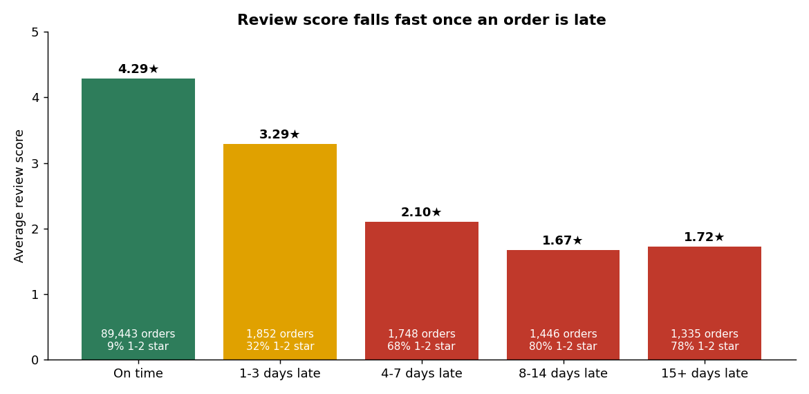
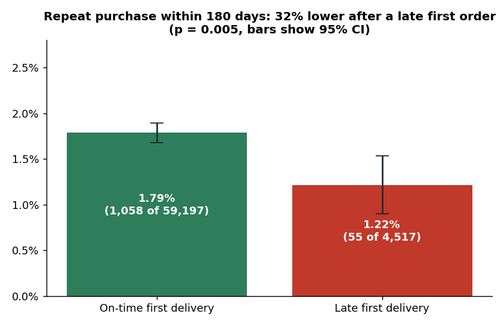
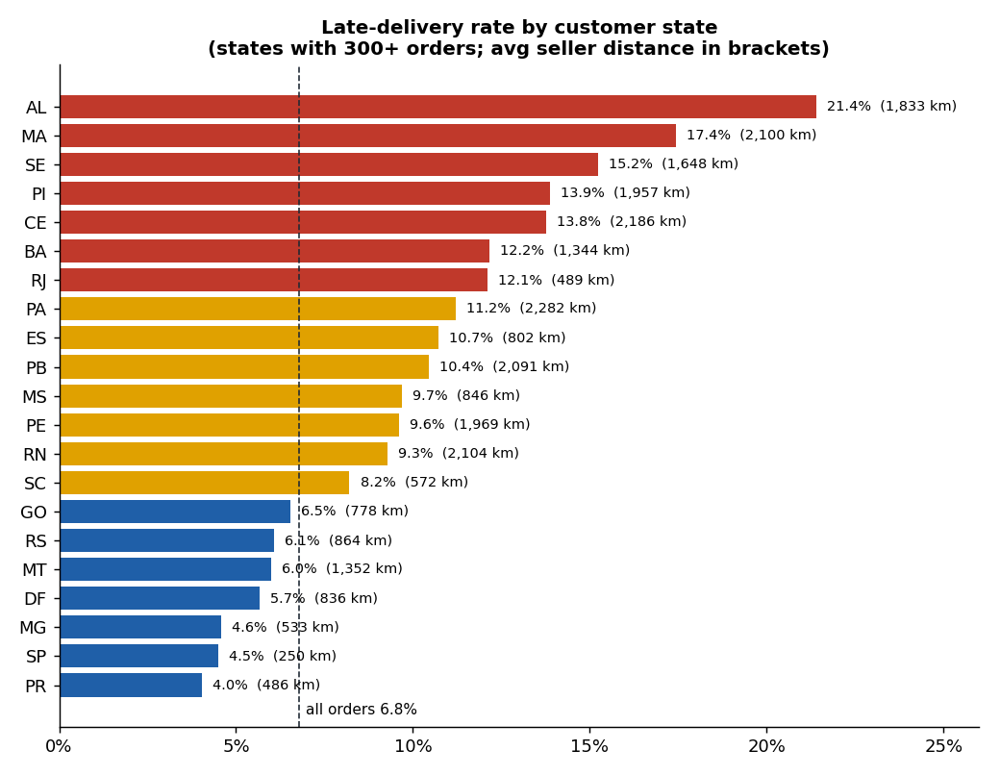
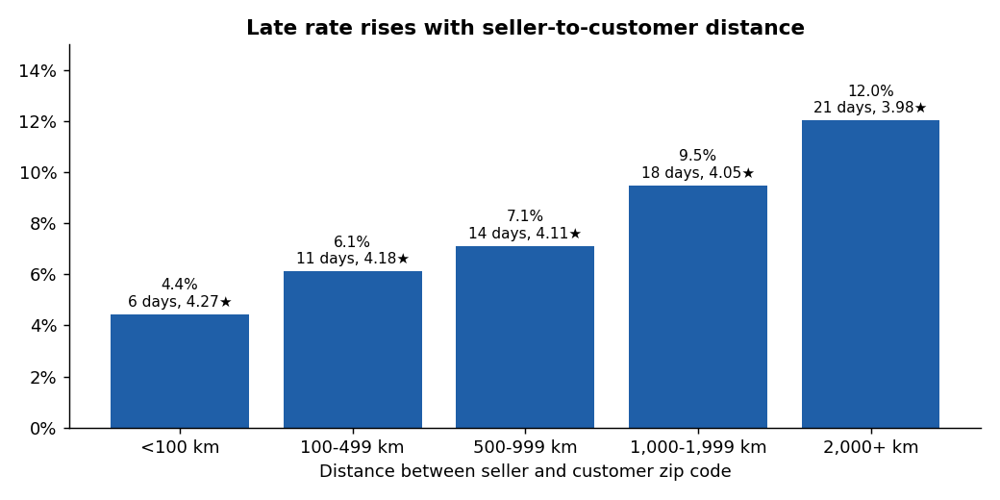
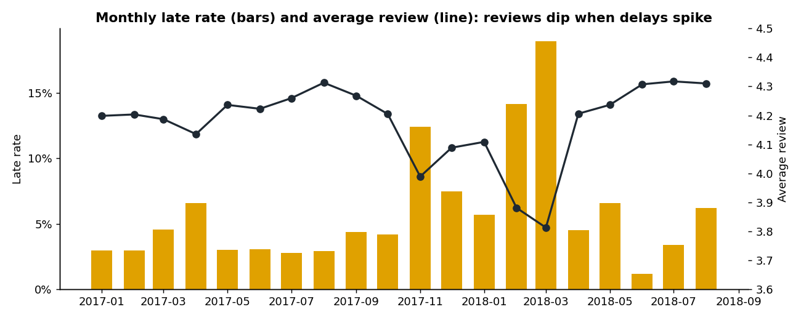

# E-commerce Delivery and Retention Analysis (Olist)

Do late deliveries hurt review scores and repeat purchases, and where do they happen?

This project joins all 9 tables of the public **Olist Brazilian e-commerce dataset** (~100K orders,
2016-2018) in a SQL pipeline (DuckDB), measures how lateness affects reviews and 180-day repeat
purchase, tests whether the retention gap is real, and breaks lateness down by state, seller,
distance and month. It exports extracts for a Tableau dashboard.

**Tools:** SQL (DuckDB: CTEs, window functions `ROW_NUMBER`, `LEAD`, `RANK`, `NTILE`, `SUM() OVER`),
Python (pandas, matplotlib), statistics (two-proportion z-test), Tableau



## Results

96,470 delivered orders from 93,350 customers and 2,959 sellers (Sep 2016 to Aug 2018).
**6.8% arrived after the promised date.** All 10 data quality checks pass.

**1. A late order turns a happy customer into an unhappy one.** Late orders averaged **2.27 stars vs 4.29**
on time. 62% of late orders got a 1-2 star review vs 9% of on-time orders (6.7x), and only 17% got 5 stars
(vs 62%). Even 1-3 days late drops the average a full star (3.29), and past a week it falls below 1.7.

**2. A late first order makes customers less likely to come back.** Among customers whose first order was
delivered at least 180 days before the data ends, **1.79%** of on-time customers ordered again within 180
days of delivery vs **1.22%** of late ones, a **32% lower repeat rate** (z = 2.82, p = 0.005; 95% CI for the gap
0.23 to 0.91 points). Repeat buying is rare on Olist overall, so this is a small absolute number, but it is
statistically clear.



**3. Lateness is concentrated in the Northeast and on long routes.** Alagoas (21.4%), Maranhão (17.4%),
Sergipe (15.2%), Piauí and Ceará (13.9% and 13.8%) have 2-3x the national late rate, and their orders travel
1,600-2,200 km on average (most sellers are in São Paulo). Late rate rises from **4.4% under 100 km to 12.0%
over 2,000 km**, and cross-state orders are late 8.0% of the time vs 4.5% in-state.





**4. Some sellers are the problem.** Splitting the 622 sellers with 30+ orders into tenths by late rate, the
worst 10% (63 sellers) shipped **16.6% late** with an average review of 3.81, while the best 10% were 0.6% late
at 4.38.

**5. Peak periods break delivery promises.** The late rate hit 19.0% in Mar 2018, 14.1% in Feb 2018 and 12.4%
in Nov 2017 (Black Friday), and the monthly average review fell to its lowest points in exactly those months.



### Recommendations

1. **Seller SLA program:** flag the worst-decile sellers monthly (`mart_seller.late_rate_decile = 1`), require
   faster hand-off to the carrier, and down-rank repeat offenders in search.
2. **Smarter delivery estimates for long routes:** promised dates already average 24 days vs 12.5 actual, so
   the issue is variance, not the average. Set estimates by route (seller state to customer state) and percentile
   instead of one buffer, starting with the Northeast states above.
3. **Service recovery:** when an order is going to be late, notify the customer early and send a next-order
   coupon. Late first-time buyers are 32% less likely to return, so this is where a win-back offer pays.
4. **Peak planning:** add carrier capacity and longer estimates ahead of Black Friday and the Feb-Mar period.

## How it works

```
9 Olist CSVs ─► 01_staging.sql ─► 02_fct_orders.sql ─► 03_customer_retention.sql ─► 04_marts.sql
                (types, review     (one row per          (ROW_NUMBER / LEAD over       (lateness, state,
                 dedupe, zip        delivered order:      each customer's orders,       seller, distance,
                 geo averages)      lateness, review,     repeat within 180 days        monthly marts)
                                    value, seller,        of first delivery)
                                    category, distance)
                                        │
                     checks.sql (10 checks) · z-test (Python) · outputs/tableau/*.csv · docs/*.png
```

Key definitions:

* **Late**: delivered on a later calendar day than the estimated delivery date shown to the customer.
* **Repeat purchase**: a second order (not canceled or unavailable) placed after the first order was delivered
  and within 180 days of that delivery. Only first orders delivered 180+ days before the last order in the data
  are counted, so recent customers aren't counted as "didn't return" before they had the chance.
* **Distance**: great-circle km between the seller's and the customer's zip prefix, using the average of all
  points per prefix in the geolocation table (coordinates outside Brazil are dropped).
* **Main seller / category**: the seller and product with the highest item price in the order.
* Reviews: some orders have several; the latest answer is kept (`ROW_NUMBER`).

## Run it

1. Download the dataset from Kaggle:
   [Brazilian E-Commerce Public Dataset by Olist](https://www.kaggle.com/datasets/olistbr/brazilian-ecommerce)
   and unzip the 9 CSV files into `data/raw/` (they are not committed, ~126 MB).
2. Then:

```bash
pip install -r requirements.txt
python -m olist build          # SQL pipeline, checks, z-test, extracts -> outputs/
python scripts/make_charts.py  # README charts -> docs/
pytest                         # 12 tests on a small hand-made dataset (no download needed)
```

`python -m olist build --window 90` changes the repeat-purchase window.

## Tableau

`python -m olist build` writes `outputs/tableau/`: `orders.csv` (one row per delivered order, ~24 MB) plus
small summary marts. See [`tableau/README.md`](tableau/README.md) for the dashboard layout and calculated
fields. The summary marts are committed; `orders.csv` is rebuilt locally.

## Project structure

```
sql/              01-04 pipeline files and checks.sql
olist/            pipeline.py (runs SQL, checks, z-test, extracts), report.py, __main__.py (CLI)
scripts/          make_charts.py
outputs/          summary.md, retention_test.json, quality_checks.csv, tableau/
docs/             charts used in this README
tableau/          dashboard guide
tests/            pytest suite
```

## Data source

Olist, *Brazilian E-Commerce Public Dataset by Olist*, Kaggle (CC BY-NC-SA 4.0). Real anonymized orders from
the Olist marketplace, 2016-2018.

## License

Code: MIT. The data keeps its own license (CC BY-NC-SA 4.0) and is not redistributed here.
